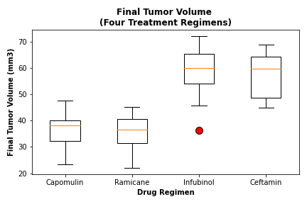

# The Power of Plots

Let's take what is learned about Python Matplotlib and apply it to a real-world situation and dataset

## Background

Assuming that I am a senior data analyst at the company called Pymaceuticals Inc., I've been given access to the complete data from their most recent animal study. In this study, 249 mice identified with SCC tumor growth were treated through a variety of drug regimens. Over the course of 45 days, tumor development was observed and measured. The purpose of this study was to compare the performance of Pymaceuticals' drug of interest, Capomulin, versus the other treatment regimens. The task given the executive team is to generate all of the tables and figures needed for the technical report of the study. The executive team also has asked for a top-level summary of the study results.

Analysis data file >> [Click Here](data/analysis_data.csv)

## Result

For the calculation method. >> [Click Here](https://nbviewer.jupyter.org/github/abpuccini/matplotlib-challenge/blob/master/pymaceuticals_analysis.ipynb)

### Summary Statistics

### Number of Mice per Drug Regimen

### The distribution of female vs male mice across all the treatments

### Four regimen of interest (Capomulin, Ramicane, Infubinol, and Ceftamin)

### Mouse ID: l509 (One example of Capomulin Treatment)

Timepoint and Tumor Volumn (mm3) is taken to plot.

### Average mouse weight and average tumor volumn (mm3)

### Correlation between Average mouse weight and average tumor volumn (mm3)

