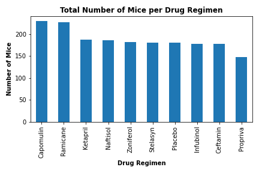

# The Power of Plots

Let take what have learned about Python Matplotlib and apply it to a real-world situation and dataset

## Background

Assuming that I am a senior data analyst at the company called Pymaceuticals Inc., I've been given access to the complete data from their most recent animal study. In this study, 249 mice identified with SCC tumor growth were treated through a variety of drug regimens. Over the course of 45 days, tumor development was observed and measured. 

The purpose of this study was to compare the performance of Pymaceuticals' drug of interest, Capomulin, versus the other treatment regimens. The task given by the executive team is to generate all of the tables and figures needed for the technical report of the study. The executive team also has asked for a top-level summary of the study results.

Analysis data file >> [Click Here](data/analysis_data.csv)

## Result

For the calculation method. >> [Click Here](https://nbviewer.jupyter.org/github/abpuccini/matplotlib-challenge/blob/master/pymaceuticals_analysis.ipynb)

### Observations and Insights

- Refer to bar chart of mice per drug regimen, there are 10 treatments in the study. The highest number of study is treated by Capomulin. On the other hand, the lowest number of study is treated by Propriva. This means the study focused toward Capomulin compared to other treatments. 

- Refer to the distribution of mouse's sex pie chart, there are more male mice treated than female mice. However, the statistics shows only 2% difference. Sex might not be the significant variable to the study. 

- Refer to box plot across 4 regimens of interest (Capomulin, Ramicane, Infubinol, and Ceftamin) and the summary statistics table, final tumor volume treated by Capomulin and Ramicane tend to have lower number than the others. Ramicane seems to have the least final tumor volume. However, the number of mice treated by Ramicane is slightly less than Capomulin. To retrieve more accurate study and conclusion, the treatment of both regimens might be continued with the same number of mice.

- Mouse ID l509 is an example of mouse treated by Capomulin, the tumor volume seems to decrease when the time has passed. Also, samples chart of 5 mice treated in the same regimen supports the assumption that Capomulin could reduce the size of tumor volumn.   

- Refer to Capomulin's correlation between average weight and final tumor volumn which is 0.84, that means there is a relation between 2 variables. Also, the r-squared 0.71 could infer that the final tumor volume could be predictable by using average weight of mouse. 

### Summary Statistics

---

### Number of Mice per Drug Regimen

*Using both pandas and pyplot method give the same result.*

* Using Pandas

* Using Pyplot

---

### The distribution of female vs male mice across all the treatments

*Using both pandas and pyplot method give the same result.*

* Using Pandas

* Using Pyplot

---

### Four regimen of interest (Capomulin, Ramicane, Infubinol, and Ceftamin)

---

### Mouse ID: l509 (One example of Capomulin Treatment)

Timepoint and Tumor Volumn (mm3) is taken to plot.

---

### Five Treatment Examples of Capomulin Treatment

---

### Average mouse weight and average tumor volumn (mm3)

---

### Correlation between Average mouse weight and average tumor volumn (mm3)

---
© Atcharaporn B Puccini
